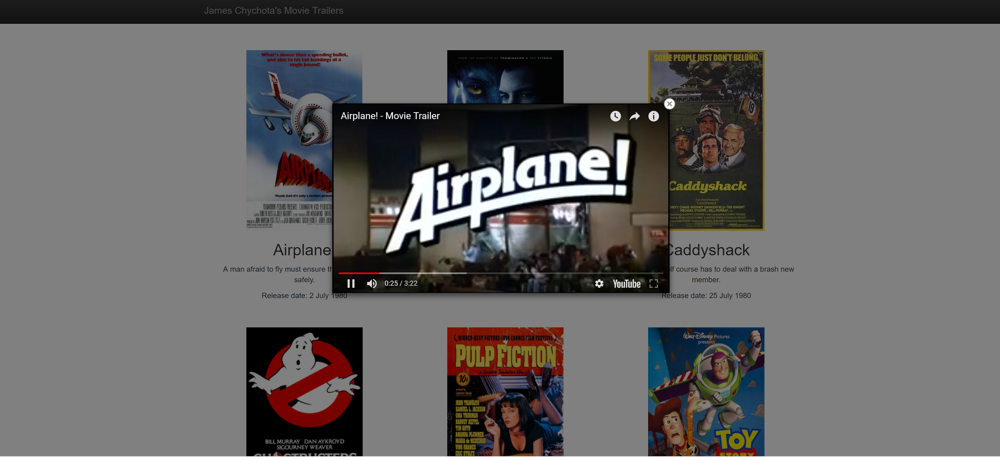

# Project Movie Trailer Website:
### submitted by James Chychota

This is project one of the Udacity Full Stack Web Developer Nanodegree.

## Project Overview
You will write server-side code to store a list of your favorite movies, including box art imagery and a movie trailer URL. You will then use your code to generate a static web page allowing visitors to browse their movies and watch the trailers.

## Resources

* [Udacity - Full Stack Web Developer Nanodegree](https://www.udacity.com/course/full-stack-web-developer-nanodegree--nd004/) - Udacity information about the Nanodegree program.
* [Google Python Style Guide](https://google.github.io/styleguide/pyguide.html) - A list of dos and don'ts for Python programs.
* [PEP 8 -- Style Guide for Python Code](https://www.python.org/dev/peps/pep-0008/) - Coding conventions for Python code.
* [Udacity - Writing READMEs](https://www.udacity.com/course/writing-readmes--ud777) - Free Udacity course on building well-structured READMEs.


## Getting Started

Clone this repository and run using python 2.7.

```sh
$ git clone https://github.com/jchychot/movie_trailer_website.git
$ cd movie_trailer_website
$ python entertainment_center.py
```

## Screen Shots


